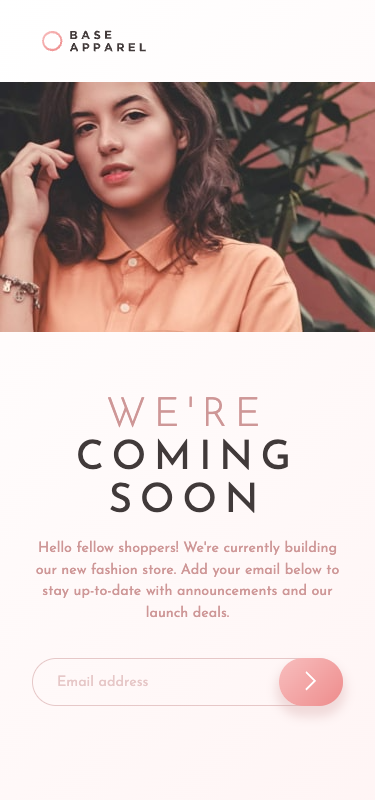

# Frontend Mentor - Base Apparel coming soon page solution

This is a solution to the [Base Apparel coming soon page challenge on Frontend Mentor](https://www.frontendmentor.io/challenges/base-apparel-coming-soon-page-5d46b47f8db8a7063f9331a0). Frontend Mentor challenges help you improve your coding skills by building realistic projects.

## Table of contents

- [Overview](#overview)
  - [The challenge](#the-challenge)
  - [Screenshot](#screenshot)
  - [Links](#links)
- [My process](#my-process)
  - [Built with](#built-with)
  - [What I learned](#what-i-learned)
  - [Continued development](#continued-development)
  - [Useful resources](#useful-resources)
- [Author](#author)
- [Acknowledgments](#acknowledgments)

**Note: Delete this note and update the table of contents based on what sections you keep.**

## Overview

### The challenge

Users should be able to:

- See the website's device specific layout
- See hover states for all interactive elements on the page
- Receive an error message when the `form` is submitted if:
  - The `input` field is empty
  - The email address is not formatted correctly

### Screenshots

Desktop view:

Mobile view:

Incorrect email input:

### Links

- Live URL: [Add live site URL here](https://your-live-site-url.com)

## My process

I didn't have a Figma design for this challenge, so the first thing I did was to find the height and width of every component on the page. Then, I attempted to calculate the margins and paddings of each element. For the desktop image, it was straightforward. However, the most challenging part was determining the correct parameters for the heading, mainly because it appeared to have a letter-spacing property, which was tricky to gauge from the picture.

Next, I began modifying the provided index.html file and set properties for the elements. The second issue I encountered was how to make the image responsive to display resizing. I couldn't merely resize the image because the challenge's documentation provided two image files for desktop and mobile designs. So, I decided to include both images and change their display property from 'block' to 'none' depending on the user's device width.

The last task was to implement email validation. For this, I used a function that checks user input against a regular expression (I found this function on Stack Overflow) and adjusted the visibility of the error icon and message from 'hidden' to 'visible' if the input was incorrect. If the next submission from the user was correct, the elements would disappear again.

### Built with

- HTML5
- CSS
- Flexbox
- JavaScript

### What I learned

During working on this project I learned several things:

- How to properly rescale SVG elements on a webpage. I decided to include the SVG logo as an inline element rather than as an image, which required a different technique for rescaling. To solve this, I utilized the viewBox property of SVG (you can learn more about it in the provided link below).
- Using two different images for desktop and mobile layouts. Previously, I usually used the same image and scaled it to fit the new width. However, employing different images can enhance design appeal and highlight the right accents in the image. To achieve this, I utilized @media queries and the display:block/none property.
- It was the first time I attempted to replicate a design as closely as possible without having all parameters provided. I found no better method than using Mac's default rectangular selection tool for images and measuring everything pixel by pixel. In the process, I also learned how to take screenshots in Chrome. Since I was working on a MacBook, Chrome by default captured screenshots in a 2:1 device pixel ratio (default for Retina displays), but the provided designs were in 375x800 and 1440x800 pixels, so I had to adjust that as well."

### Useful resources

- [How to Scale SVG](https://css-tricks.com/scale-svg/) - This arcticle helped me solve SVG scaling problem.

## Author

- Website - [Ainur Saduova](https://www.ainursaduova.com/)
- Frontend Mentor - [@NuraSad](https://www.frontendmentor.io/profile/NuraSad)
